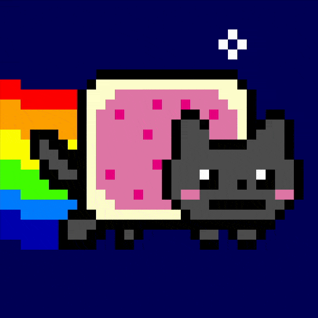

# NyanCatChat-NG



NyanCatChat-NG is a real-time chat application with end-to-end encryption built using Rust (backend) and Next.js (frontend). Messages are encrypted client-side using AES-256-GCM encryption, ensuring secure communication between users.

## Features

- Real-time chat using Socket.IO
- End-to-end encryption using AES-256-GCM
- In-memory message storage
- Typing indicators
- Shareable room links
- Clean and modern UI with dark mode support

## Architecture

### Backend (Rust)

- Built with Axum and Socket.IO
- In-memory message storage
- Message cleanup on user departure
- Room-based chat system

### Frontend (Next.js)

- Modern React with TypeScript
- TailwindCSS for styling
- Client-side encryption/decryption
- Responsive design

## Socket.IO Events

### Client to Server

| Event         | Payload                          | Description                  |
| ------------- | -------------------------------- | ---------------------------- |
| `join`        | `{ room: string, user: string }` | Join a chat room             |
| `leave`       | `{ room: string }`               | Leave current room           |
| `message`     | `{ text: string }`               | Send encrypted message       |
| `typing`      | `{ user: string }`               | Indicate user is typing      |
| `stop_typing` | `{ user: string }`               | Indicate user stopped typing |

### Server to Client

| Event            | Payload                                        | Description                      |
| ---------------- | ---------------------------------------------- | -------------------------------- |
| `message`        | `{ user: string, text: string, date: string }` | Receive message from other users |
| `message-echo`   | `{ user: string, text: string, date: string }` | Echo of sent message             |
| `messages`       | `{ messages: Message[] }`                      | History of room messages         |
| `server_message` | `string`                                       | System messages (join/leave)     |
| `typing`         | `{ user: string }`                             | User typing indicator            |
| `stop_typing`    | `{ user: string }`                             | User stopped typing              |

## Security

- All messages are encrypted client-side using AES-256-GCM before transmission
- Encryption keys are generated per room and shared via secure links
- Messages are stored encrypted in memory and cleaned up when users leave

## Development Setup

### Backend

#### Run the server

```bash
SERVER_KEY=[openssl rand -hex 16] cargo run
```

#### Run the client

```bash
cd client
npm install
npm run dev
```

## Environment Variables

### Backend

- `RUST_LOG`: Log level (default: "info")
- `SERVER_KEY`: Server encryption key for room sharing

### Frontend

- `NEXT_PUBLIC_SOCKET_SERVER`: Socket.IO server URL (default: "http://localhost:3001")

## Podman

Build and run using Podman:

```bash
podman build -t nyancatchat-ng .
podman run -p 3001:3001 -e SERVER_KEY=[openssl rand -hex 16] nyancatchat-ng
```
